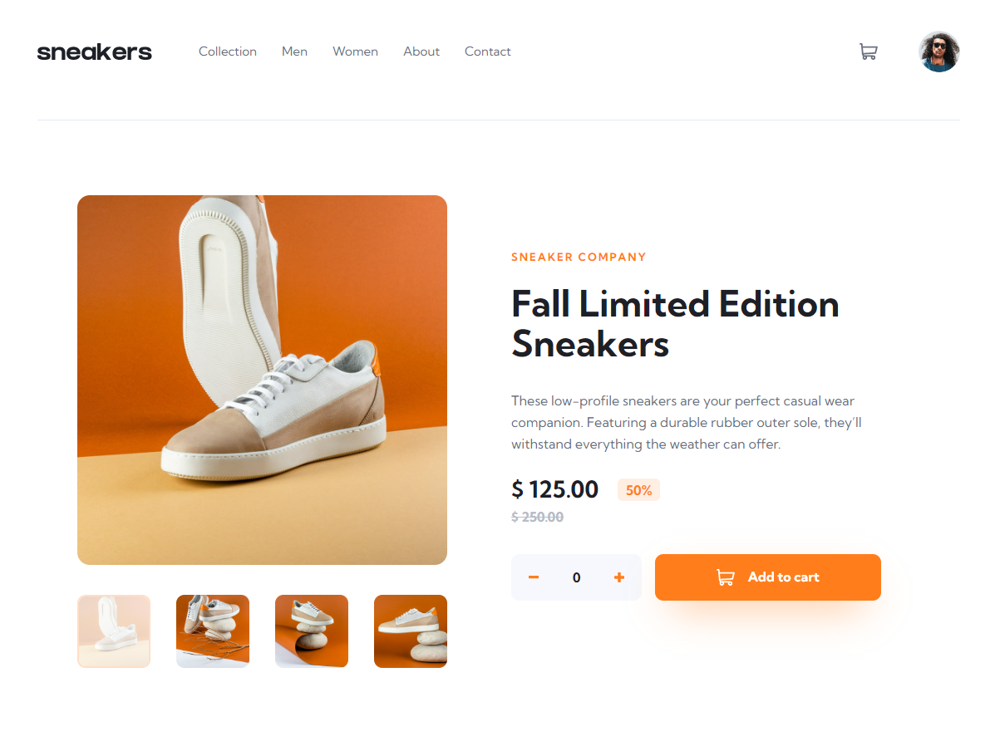

# 🛍️ Ecommerce Product Page

Página de produto de e-commerce. Projeto desenvolvido em desafio proposto pelo site Frontend Mentor. Código de autoria própria. Utilizadas as bibliotecas React e Styled-components para confecção da página. Utilização das React Hooks: useState, useEffect e useRef.
